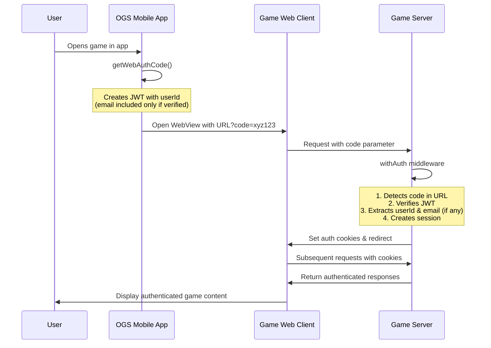
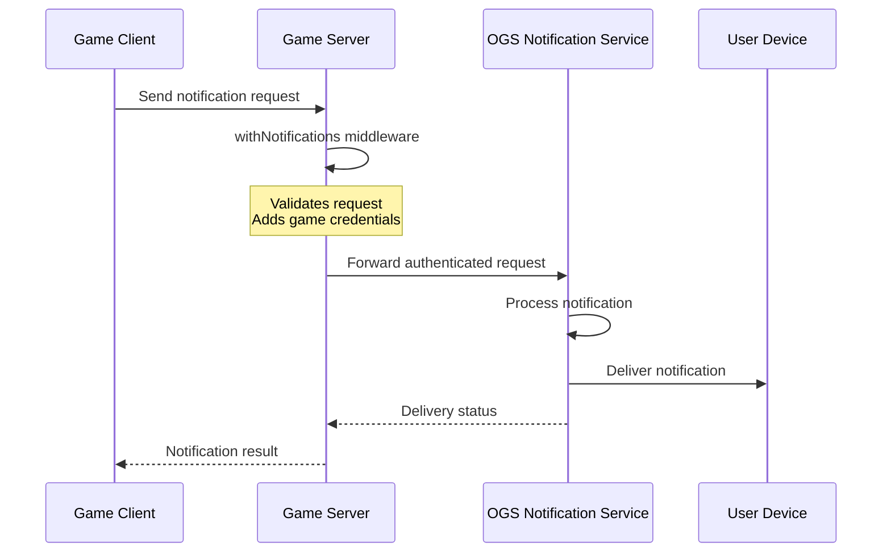
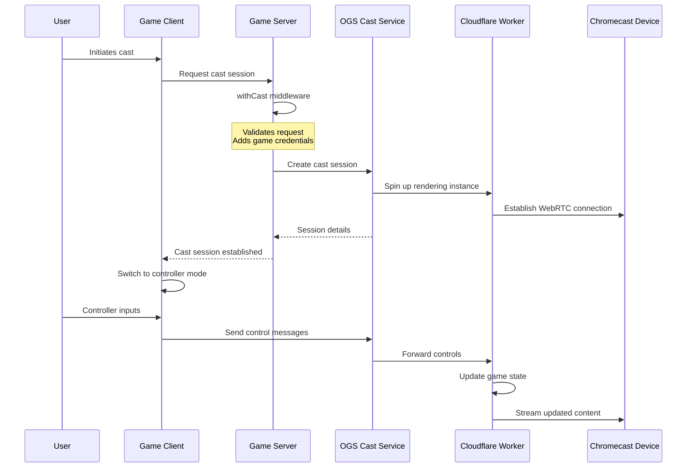

# The Open Game Collective

The Open Game Collective is an organization that develops the Open Game System (OGS), a platform enabling seamless integration between games with shared authentication and cross-platform features.

## Core Components

### Web Platform
[opengame-org](https://github.com/open-game-collective/opengame-org) - Web component of OGS that enables browser-based games to integrate with the ecosystem, providing authentication and cross-platform capabilities.

### Mobile App
[opengame-app](https://github.com/open-game-collective/opengame-app) - Mobile component of OGS for iOS/Android that extends browser-based games with mobile capabilities like push notifications and Chromecast support.

### Development Kits

- [auth-kit](https://github.com/open-game-collective/auth-kit) - Headless, isomorphic authentication toolkit for React applications with email verification and anonymous-first auth. **Required for OGS compatibility and account linking to enable push notifications.**

### Example Implementations

- [trivia-jam](https://github.com/open-game-collective/trivia-jam) - Interactive trivia platform built as a reference implementation of the OGS specification. Host custom games, compete for prizes, and create question sets.

## Open Game System (OGS) Specification v1

This section outlines requirements and guidelines for OGS v1 compatibility.

### Overview

The Open Game System bridges browser-based games with mobile capabilities, enabling web games to leverage features typically limited to native apps. OGS provides a unified authentication system and cross-platform experience, allowing browser-based games to extend their reach through both web and mobile components.

Our approach prioritizes user experience with clear, consistent implementation patterns. As the ecosystem matures, we'll evolve more flexible abstractions to make integration easier for a wider variety of games.

### Core Requirements

#### 1. Authentication Integration

All OGS-compatible games MUST implement the OGS Authentication Kit.

##### 1.1 Authentication Kit Integration

- Games MUST use the `@open-game-collective/auth-kit` package
- Games MUST implement Auth Kit as a **consumer** to enable push notifications
- Games MUST support anonymous user creation as the first authentication step
- Games MUST support email verification for account persistence
- Games MUST handle token refresh and session management
- Games MUST properly handle authentication state corruption and recovery

Key features:
- Anonymous-first authentication flow
- Email verification
- JWT-based tokens
- Automatic token refresh
- State recovery mechanisms
- Cross-platform compatibility
- Account linking for push notifications

##### 1.2 Web Auth Code Handling

Games MUST implement server-side middleware to accept web auth codes:

```typescript
// Example: Basic server-side middleware implementation
import { withAuth } from "@open-game-collective/auth-kit/server";

export default {
  async fetch(request: Request, env: Env) {
    return withAuth(async (request, env, { userId, sessionId, sessionToken }) => {
      // The user is now authenticated and you have their userId
      const url = new URL(request.url);
      // Your game API endpoints here
    }, {
      hooks: authHooks // Your auth hooks implementation
    })(request, env);
  }
};
```

**Web Auth Code Flow:**



**Key Implementation Details:**

- Web auth code: Short-lived JWT (5 minutes) containing user ID
- For verified users: JWT includes email address
- For anonymous users: Only userId is included
- Middleware verifies code using AUTH_SECRET environment variable
- After verification: Creates session and refresh tokens as cookies
- Your handler receives the authenticated userId for user data retrieval
- Determine if a user is verified by checking if email property exists in JWT payload

##### 1.3 User Identity

- Games MUST respect and utilize the user ID provided by the Authentication Kit
- Games SHOULD maintain their own independent authentication and identity systems
- Games MUST implement Auth Kit as a **consumer** to link their identity system with OGS
- Each game maintains its own user accounts while enabling cross-application features through account linking

**Important Note:** The OGS authentication model follows a provider-consumer pattern where:
- The OGS platform acts as the **provider** that manages central user accounts
- Games act as **consumers** that maintain their own independent authentication systems
- Account linking enables cross-application features (like push notifications) while preserving each game's authentication independence

#### 2. Platform Integration

Games MUST be accessible through the OGS platform.

##### 2.1 Integration Requirements

- Games MUST function properly in WebView context
- Games MUST be responsive across different screen sizes
- Games MUST handle orientation changes
- Games MUST support both touch and mouse/keyboard input

#### 3. Push Notifications

Games SHOULD support the OGS notification system.

##### 3.1 Notification Integration

- Games SHOULD use the `@open-game-collective/notification-kit` package
- Games MUST implement Auth Kit as a **consumer** to enable push notifications
- Games SHOULD associate notifications with the authenticated user ID
- Games SHOULD respect user notification preferences

**Important:** To enable push notifications, games must implement Auth Kit as a consumer application and link their independent user accounts with the OpenGame provider. This account linking allows the OpenGame app to send push notifications on behalf of your game while maintaining separate authentication systems.

**Notification Kit Architecture:**



**Server Integration:**
```typescript
// Example: Server-side middleware implementation
import { withNotifications } from "@open-game-collective/notification-kit/server";

export default {
  async fetch(request: Request, env: Env) {
    return withNotifications(async (request, env) => {
      const url = new URL(request.url);
      
      if (url.pathname === '/api/send-notification') {
        const data = await request.json();
        return new Response(JSON.stringify({ success: true }), {
          headers: { 'Content-Type': 'application/json' }
        });
      }
      
      // Other API endpoints
    }, {
      hooks: notificationHooks // Your notification hooks implementation
    })(request, env);
  }
};
```

**Example Notification Payload:**
```json
{
  "type": "game_invitation",
  "recipient": "user-123",
  "data": {
    "gameId": "trivia-456",
    "inviterId": "user-789",
    "inviterName": "PlayerOne",
    "gameName": "Trivia Night",
    "expiresAt": "2024-06-30T20:00:00Z"
  },
  "message": "PlayerOne invited you to join Trivia Night!",
  "deepLink": "opengame://trivia-jam/join/trivia-456"
}
```

##### 3.2 Common Notification Scenarios

- Game invitations (e.g., "Join my Trivia Jam game tonight!")
- Turn-based game notifications (e.g., "It's your turn in Run Set Jimmy")
- Game events (e.g., "The tournament starts in 30 minutes")
- Achievements (e.g., "You've unlocked the 'Trivia Master' badge!")

**Example Client Integration:**
```javascript
// Client-side notification registration
import { useNotifications } from '@open-game-collective/notification-kit/client';

function GameLobby() {
  const { registerForNotifications, unregisterFromNotifications } = useNotifications();
  
  useEffect(() => {
    // Register for notifications when component mounts
    registerForNotifications(['invitation', 'turn', 'event']);
    
    // Unregister when component unmounts
    return () => unregisterFromNotifications();
  }, []);
  
  // Rest of component
}
```

#### 4. Chromecast Support

Games SHOULD implement Chromecast support to enable gameplay on larger screens.

**Important:** Chromecast support does NOT require Auth Kit implementation.

##### 4.1 Cast Integration Architecture

OGS uses a custom Chromecast implementation with WebRTC for peer connections:

- Games SHOULD use the `@open-game-collective/cast-kit` package
- Games SHOULD handle cast state changes (connecting, connected, disconnected)
- Games SHOULD provide appropriate UI indicators when casting is active

**Note:** Games do NOT need to implement their own Chromecast receiver application. OGS provides a universal receiver application.

**Cast Kit Architecture:**



**Server Integration:**
```typescript
// Example: Server-side middleware implementation
import { withCast } from "@open-game-collective/cast-kit/server";

export default {
  async fetch(request: Request, env: Env) {
    return withCast(async (request, env) => {
      const url = new URL(request.url);
      
      if (url.pathname === '/api/cast/session') {
        const data = await request.json();
        return new Response(JSON.stringify({ 
          sessionId: 'cast-session-123',
          status: 'created'
        }), {
          headers: { 'Content-Type': 'application/json' }
        });
      }
      
      // Other API endpoints
    }, {
      hooks: castHooks // Your cast hooks implementation
    })(request, env);
  }
};
```

**Client Integration:**
```javascript
// Client-side cast integration
import { useCast } from '@open-game-collective/cast-kit/client';

function GameScreen() {
  const { 
    isCastAvailable, 
    isCasting, 
    startCasting, 
    stopCasting, 
    sendControlMessage 
  } = useCast();
  
  if (!isCastAvailable) return null;
  
  return (
    <div>
      {isCasting ? (
        <div className="controller-ui">
          <button onClick={() => sendControlMessage({ type: 'action', action: 'jump' })}>
            Jump
          </button>
          <button onClick={stopCasting}>
            Stop Casting
          </button>
        </div>
      ) : (
        <div className="game-ui">
          <button onClick={startCasting}>
            Cast to TV
          </button>
        </div>
      )}
    </div>
  );
}
```

### Optional Features

#### 5. Wallet Integration

**Note:** Wallet integration will be defined in a future OGS specification.

### Certification Process

To certify your game as OGS-compatible:

#### 1. Domain Verification

Create a `.well-known/opengame-association.json` file at your domain root:

```json
{
  "appId": "your-game-id",
  "name": "Your Game Name",
  "version": "1.0.0",
  "contact": "developer@yourgame.com",
  "features": ["authentication", "push-notifications", "chromecast"],
  "verification": "VERIFICATION_TOKEN"
}
```

The `VERIFICATION_TOKEN` will be provided during certification.

#### 2. Trigger Verification

After creating the `.well-known` file, trigger the verification process by making a request to:

```
https://opengame.org/api/verify?host=your-game-domain.com
```

**Note:** This endpoint is rate-limited to prevent abuse. Please avoid making multiple requests in quick succession.

#### 3. API Key Generation

After successful domain verification, our automated system will send your API key to the contact email provided in the `.well-known` file:
- Keys are specific to each game and environment
- Store securely, never expose in client-side code

### Version History

- v1.0.0 - Initial specification with core authentication, push notification, and Chromecast requirements

## Contact

- Website: [https://opengame.org](https://opengame.org)
- Email: [hello@opengame.org](mailto:hello@opengame.org)

## License

This specification is licensed under the MIT License.
