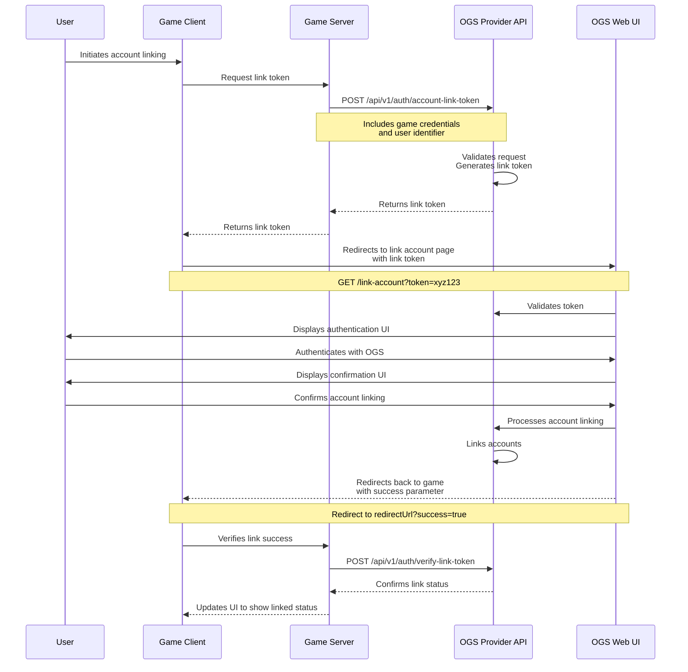
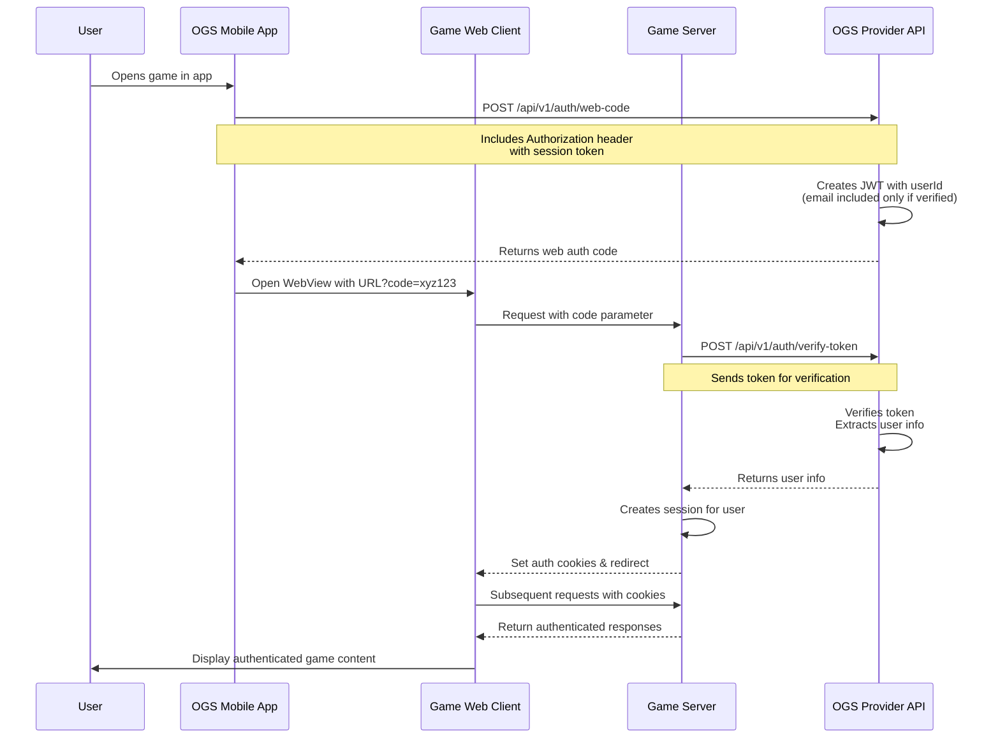
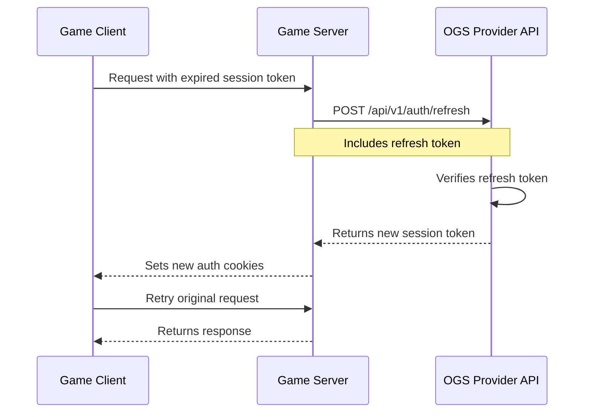
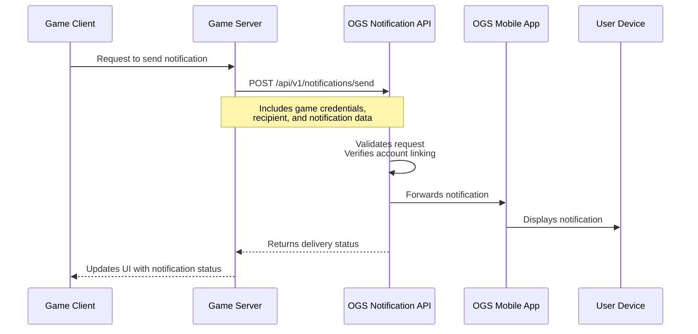
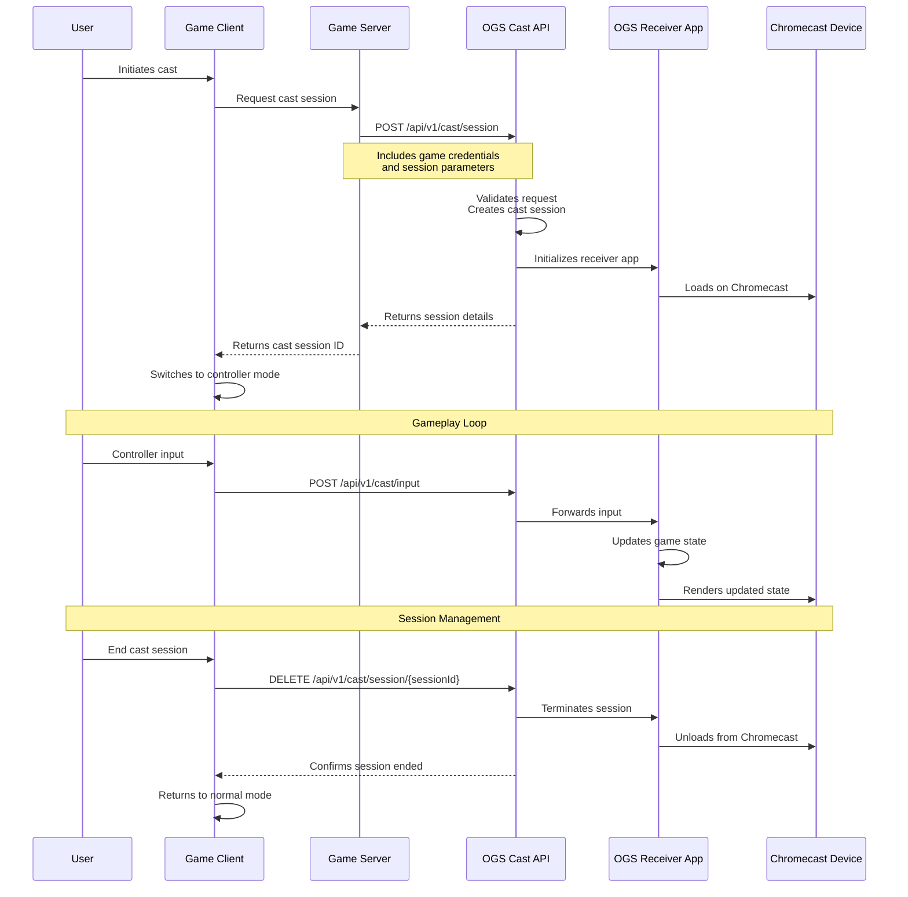

# The Open Game Collective 🎮

The Open Game Collective builds tools that empower developers to create cross-platform gaming experiences. Our Open Game System (OGS) bridges the gap between web and native capabilities, enabling developers to build once and reach players everywhere with features like push notifications 📱 and TV casting 📺 that typically require native app development.

## Core Components

### Development Kits 🧰

- [auth-kit](https://github.com/open-game-collective/auth-kit) - Implementation of the Account Linking Protocol 🔗 and Web Auth Token Protocol 🔐 that connects your game with the OGS platform. **Optional, but required if you want to implement push notifications.**

- [notification-kit](https://github.com/open-game-collective/notification-kit) - Streamlined toolkit for implementing push notifications in web games. Handles device registration, notification delivery, and deep linking with minimal configuration. **Requires auth-kit for account linking.**

- [cast-kit](https://github.com/open-game-collective/cast-kit) - Toolkit for adding TV casting capabilities to web games. Transforms phones into controllers and TVs into displays with a universal receiver application. **Completely independent and can be used without auth-kit or notification-kit.**

### Mobile App 📱
[opengame-app](https://github.com/open-game-collective/opengame-app) - Mobile component of OGS for iOS/Android where users can discover, load, and play your web games. The app enables push notifications to reach users even when they're not actively playing and provides Chromecast support for TV gameplay.

### Web Platform 🌐
[opengame-org](https://github.com/open-game-collective/opengame-org) - Web component of OGS that enables browser-based games to integrate with the ecosystem, providing account linking and cross-platform capabilities.

### Example Implementations ⭐

- [trivia-jam](https://github.com/open-game-collective/trivia-jam) - Interactive trivia platform built as a reference implementation of the OGS specification. Host custom games, compete for prizes, and create question sets.

## Open Game System (OGS) Specification v1 📋

This section outlines requirements and guidelines for OGS v1 compatibility.

### Overview

The Open Game System empowers web game developers to create truly cross-platform experiences. By bridging web, mobile and TV capabilities, OGS helps you:

1. **Reach Players Anywhere** 🌍 - Engage users across devices with a single codebase
2. **Send Push Notifications** 🔔 - Keep players engaged even when they're not actively using your game
3. **Enable TV Casting** 📺 - Transform phones into controllers and TVs into displays for immersive gameplay
4. **Simplify Distribution** 🚀 - Bypass app store restrictions and reduce development costs

OGS works by linking a player's account in your game with their account in the OGS platform, creating a seamless experience across devices while maintaining your game's independence.

Our ecosystem includes specialized development kits that can be used independently or together based on your needs:
- [auth-kit](https://github.com/open-game-collective/auth-kit) for authentication (required for push notifications)
- [notification-kit](https://github.com/open-game-collective/notification-kit) for push notifications (requires auth-kit)
- [cast-kit](https://github.com/open-game-collective/cast-kit) for TV casting (completely independent)

You can implement just the features you need - for example, you could add TV casting without implementing authentication or notifications.

Our approach prioritizes developer experience with clear, consistent implementation patterns. As the ecosystem matures, we'll evolve more flexible abstractions to make integration easier for a wider variety of games.

### Core Requirements

#### 1. Authentication Integration

Games that want to implement push notifications MUST implement the OGS Authentication Specification. **Chromecast support does NOT require authentication and can be implemented independently.**

##### 1.1 Authentication Specification

The OGS Authentication Specification defines two core mechanisms that enable cross-platform features while preserving each game's authentication independence:

1. **Account Linking Protocol 🔗**: Connects a user's game account with their OGS platform account
2. **Web Auth Token Protocol 🔐**: Enables seamless single sign-on between OGS and games once accounts are linked

**Important Distinction**: The OGS Authentication Specification is NOT about replacing your game's authentication system. Instead, it focuses on:

1. **Linking** existing accounts across systems to enable cross-platform features
2. **Enabling single sign-on** through auth tokens once accounts are linked

Games MUST maintain their own independent authentication and identity systems. The OGS platform simply provides a way to connect these systems together.

###### 1.1.1 Account Linking Protocol 🔗

The Account Linking Protocol 🔗 enables games to link their independent user accounts with the OGS platform, enabling cross-platform features like push notifications while maintaining authentication independence.

**Protocol Overview:**

1. Game server MUST request a link token from the OGS platform
2. User MUST be redirected to the OGS platform's link account page with the link token
3. User authenticates with the OGS platform and confirms the link
4. OGS platform links the accounts and redirects back to the game
5. Game server SHOULD verify the link status with the OGS platform

**HTTP Sequence for Account Linking 🔄:**



**Required API Endpoints 🛠️:**

1. **Request Link Token** (Game Server → OGS Provider)
   
   Request:
   ```http
   POST /api/v1/auth/account-link-token HTTP/1.1
   Host: api.opengame.org
   Content-Type: application/json
   Authorization: Bearer GAME_API_KEY
   
   {
     "gameUserId": "user-123",
     "redirectUrl": "https://yourgame.com/auth/callback"
   }
   ```
   
   Response:
   ```http
   HTTP/1.1 200 OK
   Content-Type: application/json
   
   {
     "linkToken": "xyz123",
     "expiresAt": "2024-06-30T20:00:00Z",
     "linkUrl": "https://opengame.org/link-account?token=xyz123"
   }
   ```

2. **Verify Link Token** (Game Server → OGS Provider)
   
   Request:
   ```http
   POST /api/v1/auth/verify-link-token HTTP/1.1
   Host: api.opengame.org
   Content-Type: application/json
   Authorization: Bearer GAME_API_KEY
   
   {
     "token": "xyz123"
   }
   ```
   
   Response:
   ```http
   HTTP/1.1 200 OK
   Content-Type: application/json
   
   {
     "valid": true,
     "userId": "ogs-user-456",
     "email": "user@example.com",
     "status": "linked",
     "linkedAt": "2024-06-29T15:35:00Z"
   }
   ```

**User-Facing Pages:**

1. **Link Account Page** (User → OGS Web UI)
   
   URL: `https://opengame.org/link-account?token=xyz123`
   
   This page handles:
   - Validating the link token
   - Authenticating the user (login or signup)
   - Displaying information about the game requesting the link
   - Obtaining user consent for the link
   - Processing the account linking
   - Redirecting back to the game's callback URL

**Error Responses ❌:**

- **Invalid API Key**:
  ```http
  HTTP/1.1 401 Unauthorized
  Content-Type: application/json
  
  {
    "error": "invalid_api_key",
    "message": "The provided API key is invalid or has been revoked"
  }
  ```

- **Invalid Token**:
  ```http
  HTTP/1.1 400 Bad Request
  Content-Type: application/json
  
  {
    "error": "invalid_token",
    "message": "The provided token is invalid or has expired"
  }
  ```

- **User Not Found**:
  ```http
  HTTP/1.1 404 Not Found
  Content-Type: application/json
  
  {
    "error": "user_not_found",
    "message": "The specified user could not be found"
  }
  ```

###### 1.1.2 Web Auth Token Protocol 🔐

The Web Auth Token Protocol 🔐 enables seamless single sign-on between the OGS platform and games, allowing users to access games through the OGS app without re-authenticating.

**Protocol Overview:**

1. OGS app requests a web auth code from the OGS platform
2. OGS app opens the game in a WebView with the code as a parameter
3. Game server verifies the code with the OGS platform
4. OGS platform returns user information
5. Game creates a session for the user

**HTTP Sequence for Web Auth Token:**



**Required API Endpoints 🛠️:**

1. **Generate Web Auth Code** (OGS App → OGS Provider)
   
   Request:
   ```http
   POST /api/v1/auth/web-code HTTP/1.1
   Host: api.opengame.org
   Content-Type: application/json
   Authorization: Bearer SESSION_TOKEN
   ```
   
   Response:
   ```http
   HTTP/1.1 200 OK
   Content-Type: application/json
   
   {
     "code": "xyz123",
     "expiresIn": 300
   }
   ```

2. **Verify Web Auth Token** (Game Server → OGS Provider)
   
   Request:
   ```http
   POST /api/v1/auth/verify-token HTTP/1.1
   Host: api.opengame.org
   Content-Type: application/json
   Authorization: Bearer GAME_API_KEY
   
   {
     "token": "xyz123"
   }
   ```
   
   Response:
   ```http
   HTTP/1.1 200 OK
   Content-Type: application/json
   
   {
     "valid": true,
     "ogsUserId": "ogs-user-456",
     "email": "user@example.com",  // Only included if verified
     "isVerified": true
   }
   ```

**Error Responses ❌:**

- **Invalid Session Token**:
  ```http
  HTTP/1.1 401 Unauthorized
  Content-Type: application/json
  
  {
    "error": "invalid_session",
    "message": "The provided session token is invalid or has expired"
  }
  ```

- **Invalid Web Auth Token**:
  ```http
  HTTP/1.1 400 Bad Request
  Content-Type: application/json
  
  {
    "error": "invalid_token",
    "message": "The provided token is invalid or has expired"
  }
  ```

**Key Implementation Details 💡:**

- Web auth token: Short-lived JWT (5 minutes) containing user ID
- For verified users: JWT includes email address
- For anonymous users: Only userId is included
- After verification: Game creates its own session for the user
- Games should determine if a user is verified by checking the `isVerified` field

###### 1.1.3 Token Refresh Protocol 🔄

The Token Refresh Protocol 🔄 enables games to refresh expired session tokens using a refresh token.

**Protocol Overview:**

1. Session token expires
2. Game server requests a new session token using the refresh token
3. OGS platform verifies the refresh token
4. OGS platform returns a new session token

**HTTP Sequence for Token Refresh:**



**Required API Endpoints 🛠️:**

1. **Refresh Token** (Game Server → OGS Provider)
   
   Request:
   ```http
   POST /api/v1/auth/refresh HTTP/1.1
   Host: api.opengame.org
   Content-Type: application/json
   Cookie: refresh=refresh-token
   
   {
     "refreshToken": "refresh-token"
   }
   ```
   
   Response:
   ```http
   HTTP/1.1 200 OK
   Content-Type: application/json
   
   {
     "success": true,
     "sessionToken": "new-jwt-token",
     "expiresIn": 900
   }
   ```

**Error Responses ❌:**

- **Invalid Refresh Token**:
  ```http
  HTTP/1.1 401 Unauthorized
  Content-Type: application/json
  
  {
    "error": "invalid_refresh_token",
    "message": "The provided refresh token is invalid or has expired"
  }
  ```

##### 1.2 Implementation Considerations

The OGS Authentication Specification is defined at the HTTP protocol level as detailed in the previous sections. This protocol specification is the source of truth for OGS compatibility.

**Auth Kit for Implementation**

For game developers, the `@open-game-collective/auth-kit` package provides a focused implementation of the Account Linking Protocol 🔗 and Web Auth Token Protocol 🔐. Auth Kit handles the specific HTTP endpoints needed for these protocols, making it significantly easier to integrate with the OGS platform.

Auth Kit is available for the consumer (game) side and provides:

- Implementation of Account Linking Protocol 🔗 endpoints
- Implementation of Web Auth Token Protocol 🔐 endpoints
- Secure token management
- React integration for UI components
- TypeScript support for type safety

For complete documentation on Auth Kit, refer to the [auth-kit repository](https://github.com/open-game-collective/auth-kit).

**Important:** Whether implementing the protocol directly or using Auth Kit, all implementations must adhere to the HTTP protocol specifications defined in this document to ensure compatibility with the OGS platform.

##### 1.3 User Identity

- Games MUST respect and utilize the user ID provided by the OGS platform when a user authenticates via web auth token
- Games SHOULD maintain their own independent authentication and identity systems
- Games MUST implement the Account Linking Protocol 🔗 to link their identity system with OGS
- Each game maintains its own user accounts while enabling cross-application features through account linking

**Security Highlights:** 🔐

1. **JWT-Based Tokens** 🔑: Secure, short-lived tokens
2. **API Key Authentication** 🛡️: Protected server communication
3. **User Consent** ✅: Clear permission for all linking
4. **Unlinking Option** ↩️: Users can disable features anytime

#### 2. Push Notifications

Push notifications are an optional feature that games can implement to engage users even when they're not actively playing. **Implementing push notifications requires authentication integration.**

##### 2.1 Notification Specification

The OGS Notification Specification defines how games can send push notifications to users through the OGS platform. Push notifications rely on the account linking established through Auth Kit, which enables the OGS platform to send notifications on behalf of your game.

**Protocol Overview:**

1. Game server sends a notification request to the OGS platform
2. OGS platform verifies the game's API key and the account link
3. OGS platform delivers the notification to the user's device
4. OGS platform returns the delivery status to the game server
5. Game server can later check the notification status (delivered, read, etc.)

**HTTP Sequence for Sending Notifications:**



**Required API Endpoints 🛠️:**

1. **Send Notification** (Game Server → OGS Notification API)
   
   Request:
   ```http
   POST /api/v1/notifications/send HTTP/1.1
   Host: api.opengame.org
   Content-Type: application/json
   Authorization: Bearer GAME_API_KEY
   
   {
     "recipient": {
       "gameUserId": "user-123"
     },
     "notification": {
       "type": "game_invitation",
       "title": "New Invitation",
       "body": "PlayerOne invited you to join Trivia Night!",
       "data": {
         "gameId": "trivia-456",
         "inviterId": "user-789",
         "inviterName": "PlayerOne",
         "gameName": "Trivia Night",
         "expiresAt": "2024-06-30T20:00:00Z"
       },
       "deepLink": "opengame://trivia-jam/join/trivia-456"
     }
   }
   ```
   
   Response:
   ```http
   HTTP/1.1 200 OK
   Content-Type: application/json
   
   {
     "id": "notification-123",
     "status": "delivered",
     "deliveredAt": "2024-06-29T15:35:00Z"
   }
   ```

2. **Get Notification Status** (Game Server → OGS Notification API)
   
   Request:
   ```http
   GET /api/v1/notifications/status/notification-123 HTTP/1.1
   Host: api.opengame.org
   Authorization: Bearer GAME_API_KEY
   ```
   
   Response:
   ```http
   HTTP/1.1 200 OK
   Content-Type: application/json
   
   {
     "id": "notification-123",
     "status": "read",
     "deliveredAt": "2024-06-29T15:35:00Z",
     "readAt": "2024-06-29T15:36:00Z"
   }
   ```

3. **Register Device** (Game Client → OGS Notification API)
   
   Request:
   ```http
   POST /api/v1/notifications/register HTTP/1.1
   Host: api.opengame.org
   Content-Type: application/json
   Authorization: Bearer SESSION_TOKEN
   
   {
     "deviceToken": "device-token-from-fcm-or-apns",
     "platform": "ios", // or "android", "web"
     "topics": ["game_invitation", "turn_notification", "event_reminder"]
   }
   ```
   
   Response:
   ```http
   HTTP/1.1 200 OK
   Content-Type: application/json
   
   {
     "success": true,
     "deviceId": "device-123"
   }
   ```

4. **Unregister Device** (Game Client → OGS Notification API)
   
   Request:
   ```http
   POST /api/v1/notifications/unregister HTTP/1.1
   Host: api.opengame.org
   Content-Type: application/json
   Authorization: Bearer SESSION_TOKEN
   
   {
     "deviceToken": "device-token-from-fcm-or-apns"
   }
   ```
   
   Response:
   ```http
   HTTP/1.1 200 OK
   Content-Type: application/json
   
   {
     "success": true
   }
   ```

**Error Responses ❌:**

- **Invalid API Key**:
  ```http
  HTTP/1.1 401 Unauthorized
  Content-Type: application/json
  
  {
    "error": "invalid_api_key",
    "message": "The provided API key is invalid or has been revoked"
  }
  ```

- **User Not Linked**:
  ```http
  HTTP/1.1 400 Bad Request
  Content-Type: application/json
  
  {
    "error": "user_not_linked",
    "message": "The specified user has not linked their account with OpenGame"
  }
  ```

- **Notification Not Found**:
  ```http
  HTTP/1.1 404 Not Found
  Content-Type: application/json
  
  {
    "error": "notification_not_found",
    "message": "The specified notification could not be found"
  }
  ```

**Key Implementation Details 💡:**

- Notifications can only be sent to users who have linked their game account with OGS
- The OGS platform handles device registration and token management
- Games should include a deep link to allow users to navigate directly to relevant content
- Notification types should be consistent across your game for better user experience
- All notification endpoints follow the standardized API versioning pattern (`/api/v1/notifications/*`)

##### 2.2 Implementation with Notification Kit 📲

The OGS Notification Specification is defined at the HTTP protocol level as detailed in the previous section. This protocol specification is the source of truth for OGS compatibility.

**Notification Kit for Implementation**

For game developers, the `@open-game-collective/notification-kit` package provides a ready-made implementation of the OGS Notification Specification. Notification Kit handles all the required HTTP endpoints and notification flows, making it significantly easier to integrate with the OGS platform.

Notification Kit is available for the consumer (game) side and provides:

- Complete implementation of all required HTTP endpoints
- Device registration and token management
- Notification delivery and status tracking
- Deep linking support

For complete documentation on Notification Kit, refer to the [notification-kit repository](https://github.com/open-game-collective/notification-kit).

**Important:** Whether implementing the protocol directly or using Notification Kit, all implementations MUST adhere to the HTTP protocol specifications defined in this document to ensure compatibility with the OGS platform.

**Important:** To enable push notifications, games must implement the Account Linking Protocol 🔗 to link their independent user accounts with the OGS platform. This account linking allows the OGS app to send push notifications on behalf of your game while maintaining separate authentication systems.

#### 3. Chromecast Support 📺

Games SHOULD implement Chromecast support to enable gameplay on larger screens.

**Important:** Chromecast support is completely independent and does NOT require Auth Kit or Notification Kit implementation. You can implement casting as a standalone feature.

##### 3.1 Cast Specification 🎮

The OGS Cast Specification defines how games can enable casting to larger screens through the OGS platform. Cast Kit follows the same architectural patterns as Auth Kit and Notification Kit, but can be used independently without requiring account linking.

**Protocol Overview:**

1. Game server creates a cast session with the OGS platform
2. OGS platform initializes the receiver application on the Chromecast device
3. Game client switches to controller mode
4. Game client sends input events to the OGS platform
5. OGS platform forwards input events to the receiver application
6. When finished, game client ends the cast session

**HTTP Sequence for Casting:**



**Required API Endpoints 🛠️:**

1. **Create Cast Session** (Game Server → OGS Cast API)
   
   Request:
   ```http
   POST /api/v1/cast/session HTTP/1.1
   Host: api.opengame.org
   Content-Type: application/json
   Authorization: Bearer GAME_API_KEY
   
   {
     "gameId": "your-game-id",
     "gameUrl": "https://yourgame.com/play?mode=cast",
     "sessionData": {
       "gameState": "initial",
       "players": ["player1", "player2"]
     }
   }
   ```
   
   Response:
   ```http
   HTTP/1.1 200 OK
   Content-Type: application/json
   
   {
     "sessionId": "cast-session-123",
     "receiverUrl": "https://receiver.opengame.org/cast?session=cast-session-123",
     "status": "created"
   }
   ```

2. **Send Input to Cast Session** (Game Client → OGS Cast API)
   
   Request:
   ```http
   POST /api/v1/cast/input HTTP/1.1
   Host: api.opengame.org
   Content-Type: application/json
   Authorization: Bearer SESSION_TOKEN
   
   {
     "sessionId": "cast-session-123",
     "inputType": "action",
     "inputData": {
       "action": "jump",
       "parameters": {
         "height": 2,
         "direction": "forward"
       }
     }
   }
   ```
   
   Response:
   ```http
   HTTP/1.1 200 OK
   Content-Type: application/json
   
   {
     "status": "delivered",
     "timestamp": "2024-06-29T15:40:00Z"
   }
   ```

3. **Get Cast Session Status** (Game Client → OGS Cast API)
   
   Request:
   ```http
   GET /api/v1/cast/session/cast-session-123 HTTP/1.1
   Host: api.opengame.org
   Authorization: Bearer SESSION_TOKEN
   ```
   
   Response:
   ```http
   HTTP/1.1 200 OK
   Content-Type: application/json
   
   {
     "sessionId": "cast-session-123",
     "status": "active",
     "createdAt": "2024-06-29T15:30:00Z",
     "lastActivityAt": "2024-06-29T15:35:00Z"
   }
   ```

4. **End Cast Session** (Game Client → OGS Cast API)
   
   Request:
   ```http
   DELETE /api/v1/cast/session/cast-session-123 HTTP/1.1
   Host: api.opengame.org
   Authorization: Bearer SESSION_TOKEN
   ```
   
   Response:
   ```http
   HTTP/1.1 200 OK
   Content-Type: application/json
   
   {
     "status": "terminated",
     "sessionId": "cast-session-123"
   }
   ```

**Error Responses ❌:**

- **Invalid API Key**:
  ```http
  HTTP/1.1 401 Unauthorized
  Content-Type: application/json
  
  {
    "error": "invalid_api_key",
    "message": "The provided API key is invalid or has been revoked"
  }
  ```

- **Session Not Found**:
  ```http
  HTTP/1.1 404 Not Found
  Content-Type: application/json
  
  {
    "error": "session_not_found",
    "message": "The specified cast session could not be found"
  }
  ```

- **Invalid Input Format**:
  ```http
  HTTP/1.1 400 Bad Request
  Content-Type: application/json
  
  {
    "error": "invalid_input",
    "message": "The provided input data is invalid or malformed"
  }
  ```

**Key Implementation Details 💡:**

- Games do NOT need to implement their own Chromecast receiver application
- OGS provides a universal receiver application that can render your game content
- The game client switches to controller mode when casting is active
- Input events are forwarded from the controller to the receiver in real-time
- Games should provide appropriate UI indicators when casting is active
- All cast endpoints follow the standardized API versioning pattern (`/api/v1/cast/*`)

##### 3.2 Implementation with Cast Kit 🎲

The OGS Cast Specification is defined at the HTTP protocol level as detailed in the previous section. This protocol specification is the source of truth for OGS compatibility.

**Cast Kit for Implementation**

For game developers, the `@open-game-collective/cast-kit` package provides a ready-made implementation of the OGS Cast Specification. Cast Kit handles all the required HTTP endpoints and casting flows, making it significantly easier to integrate with the OGS platform.

Cast Kit is available for the consumer (game) side and provides:

- Complete implementation of all required HTTP endpoints
- Cast session management
- Input event handling
- Controller mode UI components

For complete documentation on Cast Kit, refer to the [cast-kit repository](https://github.com/open-game-collective/cast-kit).

**Important:** Whether implementing the protocol directly or using Cast Kit, all implementations MUST adhere to the HTTP protocol specifications defined in this document to ensure compatibility with the OGS platform.

**Note:** Games do NOT need to implement their own Chromecast receiver application. OGS provides a universal receiver application.


### Certification Process ✅

To certify your game as OGS-compatible:

#### 1. Domain Verification 🔒

Create a `.well-known/opengame-association.json` file at your domain root:

```json
{
  "appId": "your-game-id",
  "name": "Your Game Name",
  "version": "1.0.0",
  "contact": "developer@yourgame.com",
  "features": ["authentication", "notifications", "chromecast"],
  "apiVersion": "v1",
  "verification": "VERIFICATION_TOKEN"
}
```

The `VERIFICATION_TOKEN` will be provided during certification. Include only the features you've implemented in the `features` array. The `apiVersion` field should match the version of the OGS API you're implementing (currently "v1").

#### 2. Trigger Verification 🔄

After creating the `.well-known` file, trigger the verification process by making a request to:

```
https://opengame.org/api/v1/verify?host=your-game-domain.com
```

**Note:** This endpoint is rate-limited to prevent abuse. Please avoid making multiple requests in quick succession.

#### 3. API Key Generation 🔑

After successful domain verification, our automated system will send your API key to the contact email provided in the `.well-known` file:
- Keys are specific to each game and environment
- Store securely, never expose in client-side code
- Use the API key for server-to-server communication with the OGS platform


### Version History 📝

- v1.0.0 (March 2025) - Initial OGS specification release with authentication, push notifications, and Chromecast support 🚀

## Contact 📬

- Website: [https://opengame.org](https://opengame.org)
- Email: [hello@opengame.org](mailto:hello@opengame.org)

## License ⚖️

This specification is licensed under the MIT License.